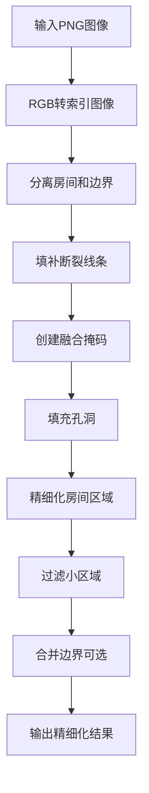

# 后处理模块使用说明

## 📋 功能概述

`postprocess.py` 是DeepFloorplan项目的后处理模块，主要用于精细化处理神经网络预测的户型图分割结果。

## 🎯 解决的问题

### 核心问题
1. **房间边界不完整** - 神经网络预测可能产生断裂的墙体线条
2. **区域标签不一致** - 同一房间可能被标记为不同类型
3. **存在噪声孔洞** - 分割结果中可能存在小的空洞
4. **小区域误检** - 过小的区域可能是噪声，需要过滤
5. **房间区域不连续** - 需要确保每个房间为连续区域

### 技术解决方案
- **线条修复**: 使用形态学操作填补断裂的墙体线条
- **区域标签优化**: 通过连通性分析确保每个房间区域有唯一标签
- **孔洞填充**: 使用泛洪填充算法填补空洞
- **噪声过滤**: 根据面积阈值过滤小区域
- **边界融合**: 可选择性地合并房间和边界信息

## 🚀 使用方法

### 基本用法
```bash
python postprocess.py --result_dir ./out
```

### 高级用法
```bash
python postprocess.py \
    --result_dir ./out \
    --min_area 150 \
    --merge_boundary \
    --verbose
```

## ⚙️ 参数说明

| 参数 | 类型 | 默认值 | 说明 |
|------|------|--------|------|
| `--result_dir` | string | `./out` | 包含网络预测结果的目录 |
| `--min_area` | int | `100` | 最小区域面积阈值（像素） |
| `--merge_boundary` | flag | `True` | 是否在输出中合并边界线 |
| `--verbose` | flag | `False` | 是否打印详细处理信息 |

## 📁 输入输出

### 输入要求
- **文件格式**: PNG图像文件
- **颜色编码**: 按照`floorplan_fuse_map`的颜色映射
- **目录结构**: 
  ```
  result_dir/
  ├── image1.png
  ├── image2.png
  └── ...
  ```

### 输出结果
- **输出目录**: `{result_dir}/post/`
- **文件格式**: 精细化处理后的PNG图像
- **改进效果**:
  - ✅ 更完整的房间边界
  - ✅ 一致的房间标签
  - ✅ 填补的孔洞
  - ✅ 过滤的噪声区域

## 🔧 已修复的问题

### 原有问题
1. ❌ **路径兼容性**: 使用Unix风格路径分隔符，Windows不兼容
2. ❌ **错误处理缺失**: 无文件不存在、格式错误等异常处理
3. ❌ **硬编码参数**: 阈值固定在代码中，缺乏灵活性
4. ❌ **无进度反馈**: 批量处理时无进度显示
5. ❌ **内存效率低**: 可能的内存泄漏

### 修复方案
1. ✅ **跨平台路径**: 使用`pathlib.Path`处理路径
2. ✅ **完善错误处理**: 添加try-catch块和错误信息
3. ✅ **参数化配置**: 支持命令行参数调整
4. ✅ **进度显示**: 使用`tqdm`显示处理进度
5. ✅ **安全操作**: 添加图像读写的安全检查

## 📊 处理流程



## 🧪 测试验证

运行测试脚本验证功能：
```bash
python test_postprocess.py
```

## 💡 使用建议

1. **调整面积阈值**: 根据图像分辨率调整`--min_area`参数
2. **查看详细信息**: 使用`--verbose`了解处理过程
3. **批量处理**: 将所有需要处理的图像放在同一目录
4. **结果验证**: 处理后检查边界完整性和标签一致性

## 🔍 故障排除

### 常见问题

1. **找不到输入文件**
   - 检查`--result_dir`路径是否正确
   - 确认目录中包含PNG文件

2. **处理失败**
   - 使用`--verbose`查看详细错误信息
   - 检查图像格式是否正确

3. **结果不理想**
   - 调整`--min_area`参数
   - 检查输入图像的颜色编码

## 📚 相关文件

- `utils/util.py` - 核心处理函数
- `utils/rgb_ind_convertor.py` - 颜色映射转换
- `test_postprocess.py` - 功能测试脚本
